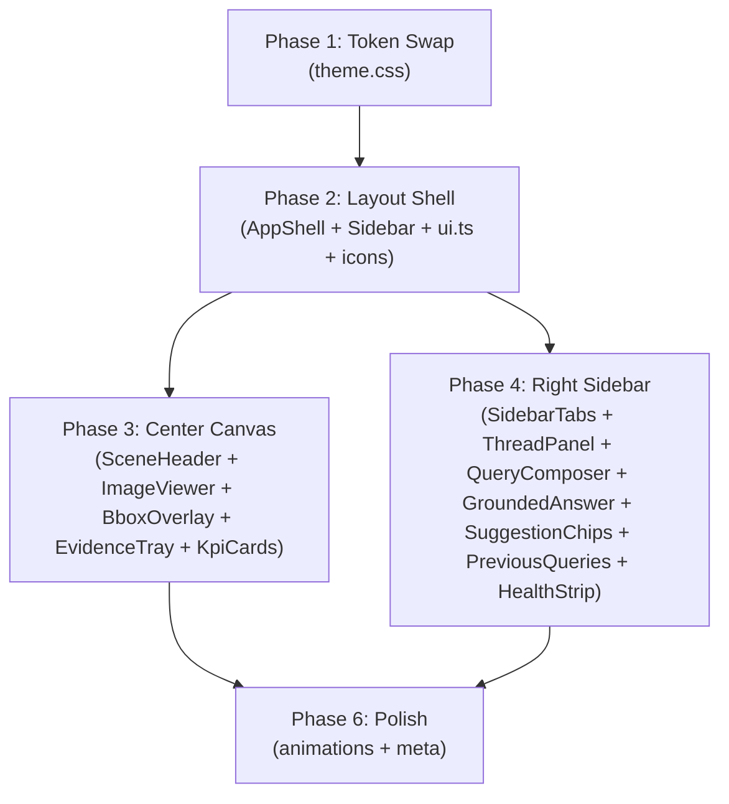

# Mission-Control Dashboard Overhaul — SatQuery AI (v2)

> All open questions resolved. Ready for execution approval.

---

## Current State

**Stack:** React 19 + Vite 6 + Tailwind v4 (`@theme` / `@custom-variant`) + TypeScript 5.9 + Zustand 5 + `react-compare-slider` v4 + `react-zoom-pan-pinch` v4

**What stays untouched:** API client ([`client.ts`](file:///home/chickenwings/SatQuery-AI/frontend/src/api/client.ts)), SSE streaming ([`sse.ts`](file:///home/chickenwings/SatQuery-AI/frontend/src/api/sse.ts)), event parser ([`events.ts`](file:///home/chickenwings/SatQuery-AI/frontend/src/api/events.ts)), job reducer ([`job.ts`](file:///home/chickenwings/SatQuery-AI/frontend/src/state/job.ts)), view grouping ([`views.ts`](file:///home/chickenwings/SatQuery-AI/frontend/src/evidence/views.ts)), KPI registry ([`registry.ts`](file:///home/chickenwings/SatQuery-AI/frontend/src/kpi/registry.ts)), citation annotation ([`annotate.ts`](file:///home/chickenwings/SatQuery-AI/frontend/src/thread/annotate.ts)), MSW mocks, test suites.

**What changes:** Design tokens, component styling, layout proportions, new UI components, and a new bbox overlay system.

---

## Phase 1: Design System — Token Swap

#### [MODIFY] [`theme.css`](file:///home/chickenwings/SatQuery-AI/frontend/src/styles/theme.css)

Replace the entire `@theme` block with dark-mode tokens. Update `@layer base` and `@layer components` rules. Preserve all `@font-face` declarations, `@custom-variant`, keyframes, and reduced-motion overrides — only change values, not structure.

**Token Mapping (complete):**

| Token | Current (light) | New (dark) | WCAG check |
|-------|----------------|------------|------------|
| `--color-bg-main` | `#faf6f0` | `#100C0A` | Canvas ground |
| `--color-surface-card` | `#ffffff` | `#211814` | Cards, panels |
| `--color-surface-sand` | `#dfa878` | `#DFA878` | Kept — secondary accent |
| `--color-line` | `#ecdcc9` | `#2A1F1A` | Borders, hairlines |
| `--color-line-soft` | `#f2e7da` | `#1E1612` | Internal rules inside cards |
| `--color-sidebar` | `#6c3428` | `#211814` | Nav column = surface now |
| `--color-sidebar-hi` | `#7d4033` | `#2D2018` | Sidebar hover |
| `--color-sidebar-text` | `#f5e9e1` | `#E8D5C4` | Sidebar foreground (7.8:1 on `#211814`) |
| `--color-sidebar-text-lo` | `#cfc4bc` | `#9A8579` | Dimmed sidebar text (4.6:1 on `#211814`) |
| `--color-sidebar-ok` | `#9dd2ab` | `#22C55E` | System Ready green (6.2:1 on `#211814`) |
| `--color-sidebar-warn` | `#ffb85f` | `#F97316` | Warning amber (4.7:1 on `#211814`) |
| `--color-text-hi` | `#2b1d17` | `#F0E6DF` | Primary text (13.4:1 on `#100C0A`) |
| `--color-text-lo` | `#6b5b52` | `#9A8579` | Secondary text (4.8:1 on `#100C0A`) |
| `--color-accent-warm` | `#ba704f` | `#BA704F` | Terracotta — kept |
| `--color-accent-warm-text` | `#a55d3d` | `#DFA878` | Sand for small text on dark (8.1:1 on `#100C0A`) |
| `--color-accent-warm-strong` | `#ab6242` | `#BA704F` | Button fill (white on it: 4.6:1) |
| `--color-accent-cool` | `#cee6f3` | `#BA704F` | Merged with primary accent — selection is terracotta now |
| `--color-on-accent-cool` | `#2b1d17` | `#FFFFFF` | White on terracotta |
| `--color-evidence` | `#f97316` | `#DFA878` | Citation pill fill (sand) |
| `--color-on-evidence` | `#2b1d17` | `#100C0A` | Dark text on sand pill |
| `--color-ok` | `#4a7c59` | `#22C55E` | Emerald green |
| `--color-ok-text` | `#3e704e` | `#22C55E` | Same green on dark (6.2:1 on `#100C0A`) |
| `--color-warn` | `#c67e00` | `#F97316` | Warm amber/orange |
| `--color-warn-text` | `#905a00` | `#F97316` | Same orange on dark (4.9:1 on `#100C0A`) |
| `--color-fail` | `#b3261e` | `#EF4444` | Brighter red for dark ground |
| `--color-skip` | `#988b80` | `#6B5F56` | Warm grey |
| `--color-skip-text` | `#71655a` | `#9A8579` | Warm grey text |

**New tokens to add:**
```css
--color-surface-elevated: #2D2018;   /* Modals, dropdowns, menus */
--color-accent-glow: rgba(186,112,79,0.15); /* Hover tints on cards/nav */
--color-bbox: rgba(186,112,79,0.7);  /* Bounding box stroke color */
--color-bbox-fill: rgba(186,112,79,0.12); /* Bounding box semi-transparent fill */
--color-bbox-label: #DFA878;         /* Bbox label text */
```

**Base rule changes:**
- `color-scheme: light` → `color-scheme: dark`
- `body` background → `var(--color-bg-main)` (already correct, just darker value)
- `::selection` background → `var(--color-accent-warm)` with `color: #fff`
- Scrollbar → `var(--color-accent-warm) transparent`
- Focus ring → stays `var(--color-accent-warm)` (already correct on dark)
- Sidebar focus ring → stays `var(--color-sidebar-text)` (already correct)

**Component class changes:**
- `.card` / `.card-flush` → `background: var(--color-surface-card)`, `border: 1px solid var(--color-line)`
- `.btn-primary` → `background: var(--color-accent-warm-strong)`, `color: #fff`
- `.btn-ghost` → `border-color: var(--color-accent-warm)`, `color: var(--color-accent-warm-text)`
- `.kbd` → `background: var(--color-surface-card)`, `border-color: var(--color-line)`
- `.chip` → unchanged structurally; colors come from usage context
- `.uncited` → wavy underline stays `var(--color-warn)` (now amber)
- Checkerboard transparency grid in `ImageViewer` → darken to `#1A1210` / `#150E0B`

**New animation:**
```css
@keyframes sq-glow {
  0%, 100% { opacity: 1; }
  50% { opacity: 0.6; }
}
```

---

## Phase 2: Layout Shell Restructuring

#### [MODIFY] [`AppShell.tsx`](file:///home/chickenwings/SatQuery-AI/frontend/src/components/shell/AppShell.tsx)

- Change grid template from `240px / 1fr / 420px` → `200px / 1fr / 380px`
- Add a `TopBar` row (mode selector + system status) spanning center + right columns above the stage, rendered as a flex bar inside the existing grid
- Left sidebar still spans full height (`row-span-full`)
- Center `<main>` gets `overflow-y: auto` (unchanged) with dark background
- Right section border changes from `border-line` → `border-line` (token value changes handle color)

#### [MODIFY] [`Sidebar.tsx`](file:///home/chickenwings/SatQuery-AI/frontend/src/components/shell/Sidebar.tsx)

Full content restructure (preserving the responsive reflow logic):

```
┌─────────────────────┐
│ 🛰  SatQuery AI      │  ← Logo + "From Space to Answers"
│ From Space to Answers│
├─────────────────────┤
│ [+ New Query  ⌘K]   │  ← CTA button (uses existing `proposeQuestion` flow)
├─────────────────────┤
│ 🏠 Home              │  ← Expanded nav — 8 items, proper SVG icons
│ 🔍 Explore     ←     │     Active item gets terracotta left-border +
│ 📊 Datasets          │     `bg-accent-glow` tint
│ 🔧 Tools             │
│ 💡 Use Cases         │
│ 🗺  Maps              │
│ 💾 Saved             │
│ 📁 Projects          │
├─────────────────────┤
│ "A clearer planet    │  ← Mission statement (existing tagline, restyled)
│  for a brighter      │
│  tomorrow"           │
│ ─────                │  ← Terracotta accent bar
├─────────────────────┤
│ 👤 Aksh              │  ← Static mock user card
│    Student·Researcher│     Avatar + name + role + settings cog
│                   ⚙  │
└─────────────────────┘
```

- Remove `recentRuns` from sidebar (moves to History tab in right panel)
- Remove `HealthStrip` from sidebar footer (moves to top bar)
- Replace Unicode glyphs (`◎`, `▤`, `⚒`, `↺`) with SVG icon components
- Keep responsive horizontal-scroll behavior on phones (base layout)
- Keep `data-region="sidebar"` for focus styling

#### [MODIFY] [`state/ui.ts`](file:///home/chickenwings/SatQuery-AI/frontend/src/state/ui.ts)

```diff
-export const NAV_SECTIONS = ['explore', 'datasets', 'tools', 'history'] as const
+export const NAV_SECTIONS = ['home', 'explore', 'datasets', 'tools', 'usecases', 'maps', 'saved', 'projects'] as const
```

- Add corresponding labels and update `LABELS` / `GLYPHS` in `Sidebar.tsx`
- Existing `section` state and `setSection` action unchanged — just new valid values
- `recentRuns` stays in the store (consumed by the new `PreviousQueries` component)

---

## Phase 3: Center Analysis Workspace

#### [NEW] [`SceneHeader.tsx`](file:///home/chickenwings/SatQuery-AI/frontend/src/components/stage/SceneHeader.tsx)

Top bar of the center workspace, rendered above the viewer:

```
Earth View ▾  │  Urban Expansion Analysis                    [Share] [Download] [⛶]
              │  Sentinel-2 · New Delhi, India · T1: 2023-01-01 vs T2: 2024-01-01
```

- **Mode selector:** Static "Earth View" chip with dropdown chevron (non-functional for now — will connect when mode switching is implemented)
- **Title:** Reads from `result?.resolved_task.primary` or validation metadata
- **Metadata strip:** Sensor, region, coordinates, temporal range — sourced from `result.trace` when available, placeholder text when not
- **Action buttons:** Share (clipboard copy), Download (triggers existing artifact download), Fullscreen (native `requestFullscreen()` on the viewer container)

#### [MODIFY] [`DataStage.tsx`](file:///home/chickenwings/SatQuery-AI/frontend/src/components/stage/DataStage.tsx)

- Import and render `<SceneHeader />` above the viewer
- Replace the existing `<header>` (which was just a bare "Analysis" heading + task chip) with the new SceneHeader
- Preserve `PreflightPanel` empty-state rendering
- Update card/container classes for dark theme

#### [MODIFY] [`ImageViewer.tsx`](file:///home/chickenwings/SatQuery-AI/frontend/src/components/stage/ImageViewer.tsx)

Wrap the existing `TransformWrapper` + `ReactCompareSlider` in a position-relative container and add overlay controls:

1. **Timestamp labels** — positioned absolute, top-left and top-right of the viewer:
   - `T1 2023-01-01` (terracotta pill, top-left)
   - `T2 2024-01-01` (terracotta pill, top-right)
   - Sourced from `group.pre?.label` / `group.post?.label` (already parsed by `roleOf`)

2. **Zoom controls** — positioned absolute, top-right column:
   - `+` / `−` buttons calling `TransformWrapper`'s `zoomIn()` / `zoomOut()` via `useControls()` hook
   - Reset button calling `resetTransform()`
   - Compass indicator (static SVG)
   - Dark pill buttons with terracotta hover

3. **Scale bar** — positioned absolute, bottom-left:
   - "0  5  10 km" graduated bar (static, or derived from image metadata when available)

4. **Feature legend** — positioned absolute, bottom-right:
   - "● New Built-up Area" pill (terracotta dot + label)
   - Only shown when `result?.resolved_task` is `CHANGE_*`

5. **BboxOverlay** — positioned absolute, full-size over the image:
   - Renders parsed bounding boxes from `result.answer.text` (see Phase 3b)
   - Scales with zoom/pan transform via `useTransformContext()`

6. **Dark card treatment:**
   - Checkerboard ground → `#1A1210` / `#150E0B` tones
   - Card border → `1px solid var(--color-line)`
   - Remove cream-colored backgrounds

#### [NEW] [`BboxOverlay.tsx`](file:///home/chickenwings/SatQuery-AI/frontend/src/components/stage/BboxOverlay.tsx) — Spatial Grounding Layer

> [!IMPORTANT]
> This is a TypeScript port of the regex parser from [`box_format.py`](file:///home/chickenwings/SatQuery-AI/src/satquery/models/prompts/box_format.py), adapted for the frontend.

**Architecture:**

```
answer.text (from AnalyzeResponse)
      │
      ▼
  parseBboxTokens(text)                 ← New: frontend/src/thread/bbox.ts
      │
      ▼
  NormalisedBox[]                       ← { xMin, yMin, xMax, yMax, label? }
      │                                   Coordinates: 0-1000 normalised
      ▼
  <BboxOverlay boxes={boxes} />         ← SVG component, absolutely positioned
      │                                   over ImageViewer's content area
      ▼
  <svg viewBox="0 0 1000 1000">         ← Maps normalised coords directly
    <rect x={box.xMin} y={box.yMin}     ← Terracotta stroke, semi-transparent fill
          width={box.xMax - box.xMin}
          ... />
    <text>{box.label}</text>             ← Sand-colored label above box
  </svg>
```

**Parser ([`bbox.ts`](file:///home/chickenwings/SatQuery-AI/frontend/src/thread/bbox.ts)):**

Port of `_parse_tagged` from [`box_format.py`](file:///home/chickenwings/SatQuery-AI/src/satquery/models/prompts/box_format.py#L231-L240):

```typescript
// Constants matching the backend's canonical form exactly
const BOX_START = '<|box_start|>'
const BOX_END   = '<|box_end|>'
const REF_START = '<|object_ref_start|>'
const REF_END   = '<|object_ref_end|>'
const BOX_SCALE = 1000

// Regex mirroring Python's _TAGGED pattern
const TAGGED_RE = new RegExp(
  `(?:${escapeRe(REF_START)}(?<label>.*?)${escapeRe(REF_END)}\\s*)?` +
  `${escapeRe(BOX_START)}\\s*(?<body>` +
  `\\(\\s*(-?\\d+)\\s*,\\s*(-?\\d+)\\s*\\)\\s*,\\s*\\(\\s*(-?\\d+)\\s*,\\s*(-?\\d+)\\s*\\))` +
  `\\s*${escapeRe(BOX_END)}`,
  'gs'
)

interface NormalisedBox {
  xMin: number; yMin: number
  xMax: number; yMax: number
  label: string | null
}

function parseBboxTokens(text: string): NormalisedBox[]
function stripBboxTokens(text: string): string  // For clean display in GroundedAnswer
```

- `parseBboxTokens` extracts all boxes from the answer text
- `stripBboxTokens` removes box markup from display text (so `GroundedAnswer` shows clean prose)
- Box coordinates clamped to `[0, BOX_SCALE]`, inverted boxes auto-corrected (matching backend)
- Degenerate boxes (zero area) silently dropped (matching backend behavior)

**Component (`BboxOverlay.tsx`):**

```tsx
<svg
  viewBox="0 0 1000 1000"
  preserveAspectRatio="none"        // Stretch to match image aspect ratio
  className="absolute inset-0 h-full w-full pointer-events-none"
  style={{ zIndex: 10 }}
>
  {boxes.map((box, i) => (
    <g key={i}>
      <rect
        x={box.xMin} y={box.yMin}
        width={box.xMax - box.xMin}
        height={box.yMax - box.yMin}
        fill="var(--color-bbox-fill)"
        stroke="var(--color-bbox)"
        strokeWidth={3}
        rx={4}
      />
      {box.label && (
        <text
          x={box.xMin} y={box.yMin - 6}
          fill="var(--color-bbox-label)"
          fontSize={14} fontWeight={600}
        >
          {box.label}
        </text>
      )}
    </g>
  ))}
</svg>
```

- SVG viewBox `0 0 1000 1000` maps directly to normalised coordinates — no pixel conversion needed
- Pointer events disabled so zoom/pan/swipe still works through the overlay
- Boxes render in terracotta stroke with 12% opacity fill
- Labels in sand color above each box
- Component receives `boxes` as a prop from `ImageViewer`, which parses them from `result.answer.text` via `useMemo`

#### [MODIFY] [`EvidenceTray.tsx`](file:///home/chickenwings/SatQuery-AI/frontend/src/components/stage/EvidenceTray.tsx)

Restyle as multi-spectral strip (keep dynamic `ViewGroup` rendering):

- Larger thumbnail cards: `w-[160px]` (up from `w-[112px]`)
- Dark card backgrounds: `bg-surface-card` with `border-line`
- Active state: terracotta border + subtle glow instead of `bg-accent-cool`
- Descriptive sublabel format: "Sentinel-2 · 10m" (parsed from existing `group.code` → resolution lookup)
- Remove the "Evidence" eyebrow heading, replace with inline section within the viewer area
- Keep `sq-arrive` animation

#### [MODIFY] [`KpiCards.tsx`](file:///home/chickenwings/SatQuery-AI/frontend/src/components/stage/KpiCards.tsx)

Restyle as "Key Insights" strip:

- Dark surface cards: `bg-surface-card`, `border-line`
- Add a sand-colored icon/glyph before each metric label (grid icon, area icon, leaf icon, calendar icon)
- Active state → terracotta border (replacing `bg-accent-cool`)
- Warning badge: amber triangle `▲` for model-estimated values (reuses existing `degradedIds` check)
- Sub-label text: "(in analyzed region)", "(model estimate)", "(decrease)" etc.
- Keep existing `formatKpi`, `decimal`, `card.delta` logic untouched

---

## Phase 4: Right Intelligence Sidebar

#### [NEW] [`SidebarTabs.tsx`](file:///home/chickenwings/SatQuery-AI/frontend/src/components/thread/SidebarTabs.tsx)

Tab bar component: **Chat** | **Results** | **Citations** | **History**

- Local component state (not Zustand — tab selection is purely presentational)
- Each tab is a `<button>` with `aria-selected`
- Active tab: terracotta underline border + white text
- Inactive: `text-lo` color

#### [MODIFY] [`ThreadPanel.tsx`](file:///home/chickenwings/SatQuery-AI/frontend/src/components/thread/ThreadPanel.tsx)

Major restructure around tabs:

1. **Header area:**
   - `<SidebarTabs />` at top
   - System status badge ("● System Ready") — moved from `HealthStrip`, shows in the top-right corner of the right panel header

2. **Chat tab (default):**
   - `<QueryComposer />` pinned at top
   - `<SuggestionChips />` below composer
   - Response area: `<GroundedAnswer />` wrapped in an "Audited Response Card" container with:
     - SatQuery AI avatar + "Just now" timestamp header
     - Inline action row (copy, bookmark, share icons)
     - Verification disclaimer box at bottom (amber warning for model-derived estimates)
     - "View Processing Pipeline" / "View Sources" buttons
   - `<PipelinePulse />` below answer
   - `<ConfidenceBlock />` below pipeline

3. **Results tab:** Confidence breakdown (existing `ConfidenceBlock`) + KPI summary
4. **Citations tab:** Flat list of all `answer.citations` with source details
5. **History tab:** `<PreviousQueries />` component (migrated from sidebar)

#### [MODIFY] [`QueryComposer.tsx`](file:///home/chickenwings/SatQuery-AI/frontend/src/components/thread/QueryComposer.tsx)

Visual restyle only (logic untouched):

- Dark input card: `bg-surface-card` border, `border-line`, terracotta focus ring
- Bottom bar controls: image attachment icon (📷), "Auto" mode chip with dropdown chevron, terracotta send arrow button (`→`)
- Replace `Ask` / `Running…` text button with icon-only circle button (terracotta bg, white arrow)
- Character counter and keyboard hints stay, restyled for dark

#### [NEW] [`SuggestionChips.tsx`](file:///home/chickenwings/SatQuery-AI/frontend/src/components/thread/SuggestionChips.tsx)

Row of quick-action suggestion pills:

- Default chips: "Compare vegetation before and after 2020", "Find floods in my area", "Detect new constructions", "Show NDVI trend"
- When `validation?.supported_tasks` is available, generate chips from supported task types
- Each chip calls `useFocusStore.proposeQuestion(text)` on click
- Styled as outlined pills: `border-line`, `text-lo`, rounded-full, terracotta hover

#### [MODIFY] [`GroundedAnswer.tsx`](file:///home/chickenwings/SatQuery-AI/frontend/src/components/thread/GroundedAnswer.tsx)

- **Before rendering:** Strip bbox tokens from display text using `stripBboxTokens()` from the new `bbox.ts` parser — boxes render visually on the map, not as markup in the chat
- Citation pills: `bg-evidence` → sand fill with dark text (tokens already handle this)
- Uncited wavy underline: `var(--color-warn)` → amber on dark (tokens handle it)
- **New: Verification disclaimer box** — rendered after the answer when `uncited_numeric_spans.length > 0`:
  ```
  ┌────────────────────────────────────────────┐
  │ ▲ This value is a model-derived estimate.  │
  │   Verify with higher-resolution data.      │
  └────────────────────────────────────────────┘
  ```
  Amber left-border, `bg-warn/10` background, warn-text content

#### [NEW] [`PreviousQueries.tsx`](file:///home/chickenwings/SatQuery-AI/frontend/src/components/thread/PreviousQueries.tsx)

History list component (moved from sidebar):

- Consumes `useUiStore.recentRuns`
- Each entry: dot indicator (status color) + query text (truncated) + relative timestamp ("Just now", "2 hours ago", etc.)
- "View all →" link at header (navigates to `section: 'history'`)
- Dark card rows with `border-line-soft` separators

#### [MODIFY] [`HealthStrip.tsx`](file:///home/chickenwings/SatQuery-AI/frontend/src/components/shell/HealthStrip.tsx)

- Relocated from sidebar footer to top-bar header (right side)
- Simplified to a compact badge: `● System Ready` (emerald dot + text)
- Degraded state: `● Degraded` (amber)
- Unreachable: `● Offline` (red)
- Bell notification icon next to it
- Detailed device info (VRAM, tools, igpu_masked) shown in a tooltip/popover on hover

---

## Phase 5: New UI Assets

#### [NEW] [`icons.tsx`](file:///home/chickenwings/SatQuery-AI/frontend/src/components/ui/icons.tsx)

Inline SVG icon components — no icon library dependency. Each is a `React.FC<SVGProps<SVGSVGElement>>`:

**Nav icons:** Home, Explore (compass), Datasets (grid), Tools (wrench), UseCases (lightbulb), Maps (globe), Saved (bookmark), Projects (folder)

**Action icons:** Plus, Share, Download, Fullscreen, ZoomIn, ZoomOut, Reset, Settings, Bell, Send (arrow), Camera, Copy, Bookmark, ChevronDown

**Status icons:** Dot (filled circle for status indicators)

All icons: 20×20 default viewBox, `currentColor` fill/stroke, `aria-hidden="true"` by default.

#### [NEW] [`ModeSelector.tsx`](file:///home/chickenwings/SatQuery-AI/frontend/src/components/shell/ModeSelector.tsx)

Static "Earth View" chip in the top bar header:

- Globe icon + "Earth View" text + chevron-down
- Dark pill: `bg-surface-card`, `border-line`, `text-hi`
- Non-functional dropdown for now — scaffolded with `aria-haspopup` and an empty `onClick`
- Future: will wire to analysis mode switching

---

## Phase 6: Polish & Micro-Animations

#### [MODIFY] [`theme.css`](file:///home/chickenwings/SatQuery-AI/frontend/src/styles/theme.css) (second pass)

- **Card hover glow:** `transition: border-color 120ms ease` — border shifts from `var(--color-line)` to `rgba(186,112,79,0.4)` on hover
- **Nav active indicator:** 3px terracotta left border on active nav item + `bg-accent-glow` tint
- **System Ready pulse:** `sq-glow` keyframe on the emerald status dot (subtle opacity pulse, 2s duration)
- **Bbox appear animation:** boxes fade in with `sq-arrive` (existing animation, reused) when answer loads
- All new animations gated on `prefers-reduced-motion` — reduce to `opacity: 1; animation: none`
- All transitions limited to `background-color`, `border-color`, `opacity`, `transform` — no layout properties

#### [MODIFY] [`index.html`](file:///home/chickenwings/SatQuery-AI/frontend/index.html)

- Add `<meta name="theme-color" content="#100C0A" />`
- Update `<meta name="description">` for SEO
- Update `<title>` to "SatQuery AI — Mission Control"

---

## File Change Summary

| # | Action | File | Phase | Scope |
|---|--------|------|-------|-------|
| 1 | **MODIFY** | [`theme.css`](file:///home/chickenwings/SatQuery-AI/frontend/src/styles/theme.css) | 1, 6 | Token swap + component styles + animations |
| 2 | **MODIFY** | [`AppShell.tsx`](file:///home/chickenwings/SatQuery-AI/frontend/src/components/shell/AppShell.tsx) | 2 | Grid proportions + top bar |
| 3 | **MODIFY** | [`Sidebar.tsx`](file:///home/chickenwings/SatQuery-AI/frontend/src/components/shell/Sidebar.tsx) | 2 | Full nav rail redesign |
| 4 | **MODIFY** | [`state/ui.ts`](file:///home/chickenwings/SatQuery-AI/frontend/src/state/ui.ts) | 2 | Expand `NAV_SECTIONS` |
| 5 | **MODIFY** | [`DataStage.tsx`](file:///home/chickenwings/SatQuery-AI/frontend/src/components/stage/DataStage.tsx) | 3 | Scene header integration |
| 6 | **MODIFY** | [`ImageViewer.tsx`](file:///home/chickenwings/SatQuery-AI/frontend/src/components/stage/ImageViewer.tsx) | 3 | Overlay controls + bbox + dark styling |
| 7 | **MODIFY** | [`EvidenceTray.tsx`](file:///home/chickenwings/SatQuery-AI/frontend/src/components/stage/EvidenceTray.tsx) | 3 | Multi-spectral strip restyle |
| 8 | **MODIFY** | [`KpiCards.tsx`](file:///home/chickenwings/SatQuery-AI/frontend/src/components/stage/KpiCards.tsx) | 3 | Dark key-insights cards |
| 9 | **MODIFY** | [`ThreadPanel.tsx`](file:///home/chickenwings/SatQuery-AI/frontend/src/components/thread/ThreadPanel.tsx) | 4 | Tabbed sidebar + response card |
| 10 | **MODIFY** | [`QueryComposer.tsx`](file:///home/chickenwings/SatQuery-AI/frontend/src/components/thread/QueryComposer.tsx) | 4 | Dark chat interface |
| 11 | **MODIFY** | [`GroundedAnswer.tsx`](file:///home/chickenwings/SatQuery-AI/frontend/src/components/thread/GroundedAnswer.tsx) | 4 | Bbox strip + disclaimer box |
| 12 | **MODIFY** | [`HealthStrip.tsx`](file:///home/chickenwings/SatQuery-AI/frontend/src/components/shell/HealthStrip.tsx) | 4 | Relocate to header + compact badge |
| 13 | **MODIFY** | [`index.html`](file:///home/chickenwings/SatQuery-AI/frontend/index.html) | 6 | Meta tags |
| 14 | **NEW** | `frontend/src/thread/bbox.ts` | 3 | Bbox token parser |
| 15 | **NEW** | `frontend/src/components/stage/BboxOverlay.tsx` | 3 | SVG bbox renderer |
| 16 | **NEW** | `frontend/src/components/stage/SceneHeader.tsx` | 3 | Scene title + metadata |
| 17 | **NEW** | `frontend/src/components/thread/SidebarTabs.tsx` | 4 | Tab bar |
| 18 | **NEW** | `frontend/src/components/thread/SuggestionChips.tsx` | 4 | Quick-action chips |
| 19 | **NEW** | `frontend/src/components/thread/PreviousQueries.tsx` | 4 | History list |
| 20 | **NEW** | `frontend/src/components/ui/icons.tsx` | 5 | SVG icon set |

**Total: 13 modified + 7 new = 20 files**

---

## Execution Order



> Phase 3 and Phase 4 can proceed in parallel — they share no components.

---

## Verification Plan

### Automated
```bash
cd frontend && npm run typecheck    # TypeScript compilation
cd frontend && npm run test         # Existing vitest suite
cd frontend && npm run lint         # Oxlint
cd frontend && npm run build        # Production bundle
```

### Manual
1. **Visual match** — `npm run dev`, compare with reference screenshot at 1440px
2. **Dark mode contrast** — DevTools contrast checker on all text/icon tokens
3. **A/B slider** — compare slider handle still works, `[`/`]` keyboard shortcuts
4. **Bbox overlay** — mock a response with `<|box_start|>` tokens, verify SVG rectangles render over the image at correct positions, scale with zoom
5. **Citation flow** — click citation → evidence tray → KPI card → pipeline modal
6. **Suggestion chips** — click chip → text appears in composer, caret at end
7. **Tabbed sidebar** — switch tabs, history shows recent queries
8. **Responsive** — 390px (phone), 768px (tablet), 1440px (desktop)
9. **MSW mock** — `?mock=1` still works
10. **Reduced motion** — all new animations suppressed
